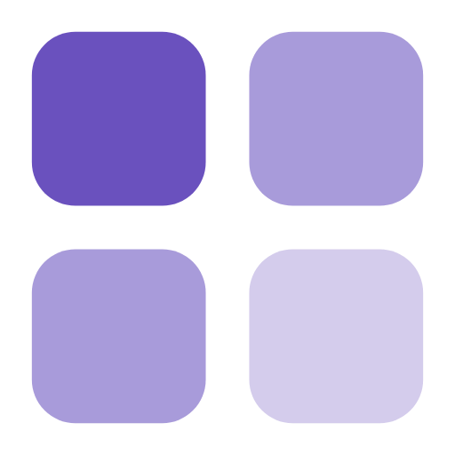

<div align="center">



# ShareCube plugin

**Publish, edit, and comment on shareable HTML and Markdown artifacts from your coding agent.**

[](https://github.com/infragate/sharecube-plugin/actions/workflows/validate.yml)
[](https://agent-plugins.org)
[](https://docs.infragate.ai/sharecube/mcp/)
<br>
[](#claude-code)
[](#hosts)
[](#hosts)

[Website](https://sharecube.io) · [Docs](https://docs.infragate.ai/sharecube/) · [MCP setup](https://docs.infragate.ai/sharecube/mcp/)

</div>

---

## What it does

Your agent writes a report, a plan, or a page. ShareCube turns it into a link your team can open, comment on, and edit. The plugin gives the agent:

- **The ShareCube MCP server** at `https://app.sharecube.io/mcp`, for creating, finding, editing, and commenting on artifacts. Sign-in is OAuth, so there are no keys to configure.
- **A `sharecube` skill** that tells the agent when to reach for ShareCube and how to use it well: partial edits instead of full rewrites, anchored comments, and real @mentions.

## Install

### Claude Code

```
/plugin marketplace add infragate/sharecube-plugin
/plugin install sharecube@sharecube
```

The first ShareCube tool call opens a browser window to sign in.

### Hosts

One tree serves every host. Each reads its own manifest and shares the same skill and MCP server.

| Host | Manifest | MCP config |
| --- | --- | --- |
| [Agent Plugins](https://agent-plugins.org) clients | `plugin.json` | `mcp.json` |
| Claude Code | `.claude-plugin/plugin.json` | `.mcp.json` |
| Cursor | `.cursor-plugin/plugin.json` | `.mcp.json` |
| Codex | `.codex-plugin/plugin.json` | `.mcp.json` |

`mcp.json` and `.mcp.json` describe the same server. They are separate because the Agent Plugins schema calls the transport `streamable-http` and the other hosts call it `http`.

## Development

Try your working copy in Claude Code:

```
claude --plugin-dir .
```

Check the manifests before you push:

```
node scripts/check-manifests.mjs
```

It fails if the manifests disagree on name or version, reference a file that does not exist, or describe different MCP servers. CI runs it on every push and pull request, along with the Agent Plugins 1.1.0 schemas and `claude plugin validate`.

To release, bump `version` in all four manifests together.
